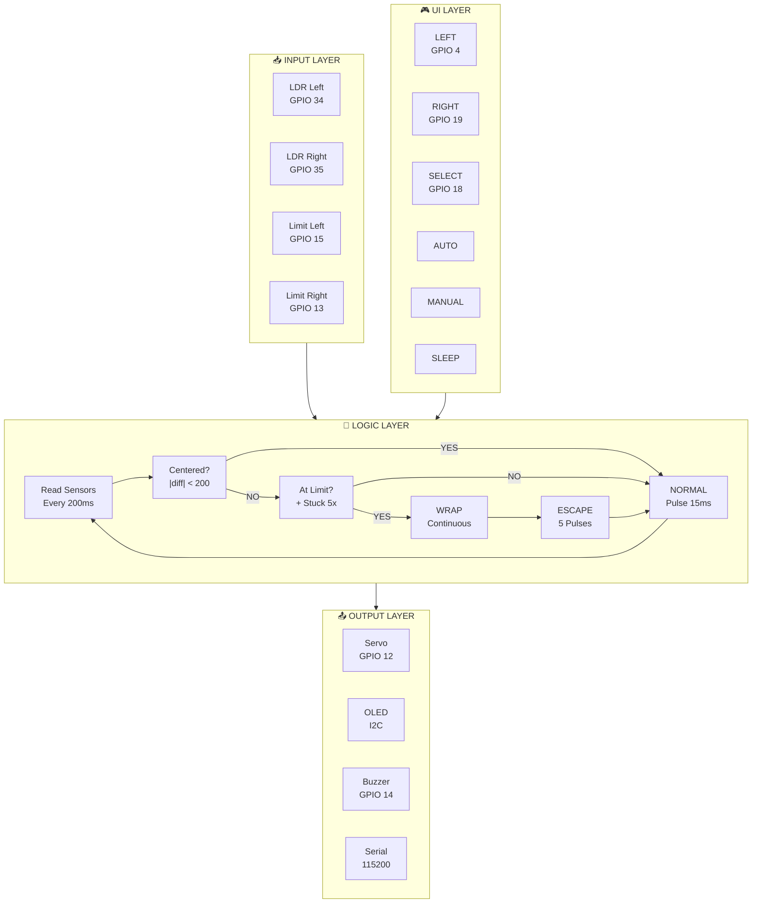
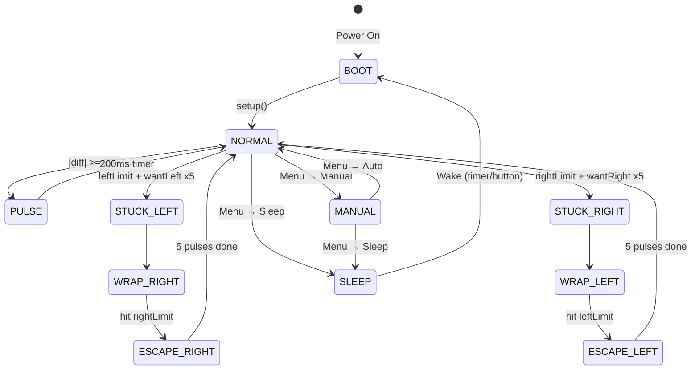
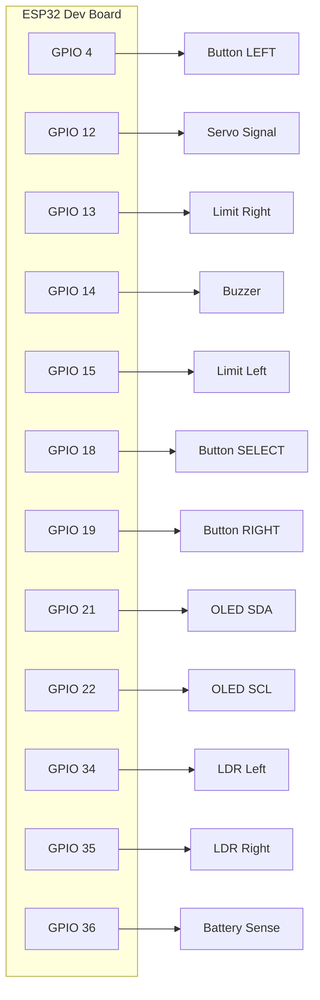

# Solar Tracker — Mermaid Diagrams

## 1. System Architecture



---

## 2. Auto Tracking State Machine



---

## 3. Main Loop Flow

```mermaid
flowchart TD
    START([Start]) --> LOOP{Main Loop}
    LOOP --> BUZZ[Update Buzzer]
    LOOP --> SERVO_STOP[Check Servo Timer]
    LOOP --> LIMIT[Read Limiters]
    LOOP --> LDR[Read LDRs]
    LOOP --> BTN[Check Buttons]
    LOOP --> AUTO[Auto Tracking?]
    LOOP --> DISP[Update Display]
    
    AUTO -->|NO| LOOP
    AUTO -->|YES| TRACK{trackingState}
    
    TRACK -->|NORMAL| ESC{escapeSteps?}
    ESC -->|>0| DO_ESC[Escape Pulse]
    ESC -->|0| LOGIC[trackingLogic]
    
    LOGIC --> CTR{|diff| < 200?}
    CTR -->|YES| STOP[Stop Servo]
    CTR -->|NO| LIM_CHK{At Limit?}
    
    LIM_CHK -->|NO| HYST{Dir Changed?}
    LIM_CHK -->|YES| STUCK{Stuck 5x?}
    
    STUCK -->|NO| STOP2[Stop + Block Dir]
    STUCK -->|YES| SET_WRAP[Set WRAP Mode]
    
    HYST -->|YES| STOP3[Stop]
    HYST -->|NO| DO_PULSE[Pulse Toward Light]
    
    TRACK -->|WRAP_LEFT| WL{leftLimit?}
    WL -->|NO| ROT_L[Rotate Left]
    WL -->|YES| SET_ESC_L[Set Escape Right]
    
    TRACK -->|WRAP_RIGHT| WR{rightLimit?}
    WR -->|NO| ROT_R[Rotate Right]
    WR -->|YES| SET_ESC_R[Set Escape Left]
    
    DO_ESC --> LOOP
    DO_PULSE --> LOOP
    STOP --> LOOP
    STOP2 --> LOOP
    STOP3 --> LOOP
    SET_WRAP --> LOOP
    ROT_L --> LOOP
    ROT_R --> LOOP
    SET_ESC_L --> LOOP
    SET_ESC_R --> LOOP
```

---

## 4. Component Wiring Diagram



---

## Styling Reference (for Figma)

| Element | Fill | Stroke | Text |
|---------|------|--------|------|
| Input Layer | `#1e3a5f` | `#4a9eed` | `#4a9eed` |
| Logic Layer | `#2d1b69` | `#8b5cf6` | `#a78bfa` |
| Output Layer | `#1a4d2e` | `#22c55e` | `#22c55e` |
| UI Layer | `#5c3d1a` | `#f59e0b` | `#f59e0b` |
| Decision Diamond | `#5c3d1a` | `#f59e0b` | `#f59e0b` |
| Normal State | `#1a4d2e` | `#22c55e` | `#22c55e` |
| Wrap State | `#5c1a1a` | `#ef4444` | `#ef4444` |
| Escape State | `#5c3d1a` | `#f59e0b` | `#f59e0b` |
| YES arrow | — | `#22c55e` | `#22c55e` |
| NO arrow | — | `#ef4444` | `#ef4444` |
| Background | `#1e1e2e` | — | `#e5e5e5` |

Font: Inter or Arial, 12-16px for labels, 20-28px for titles
